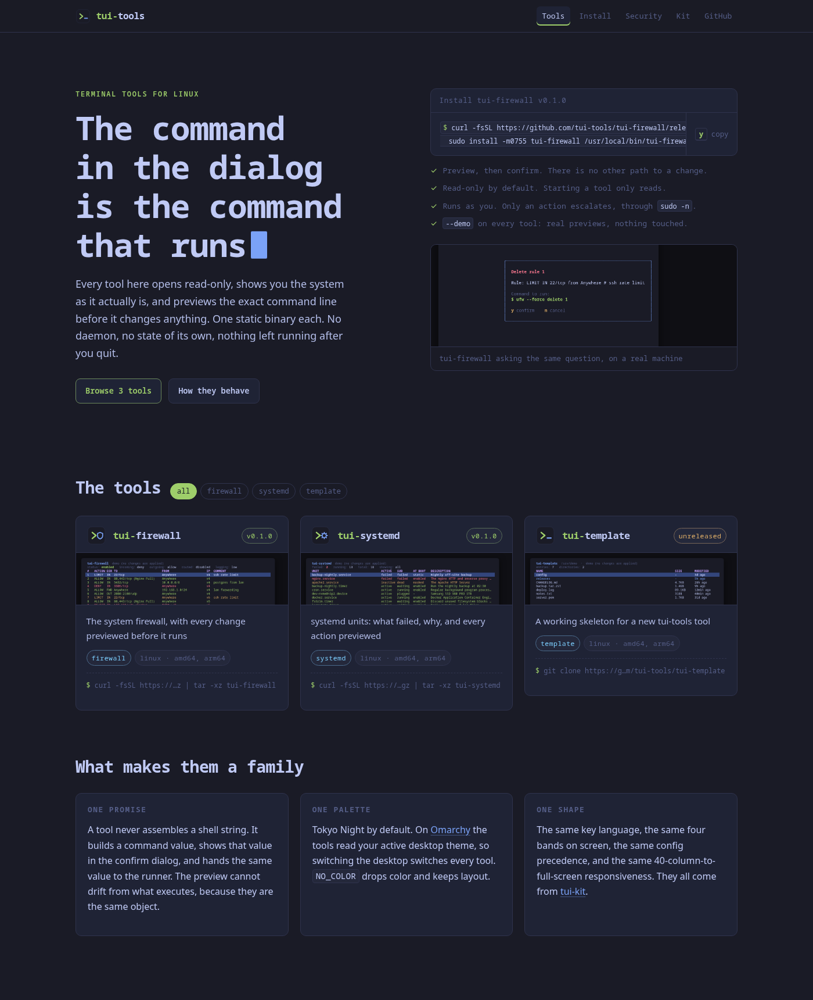
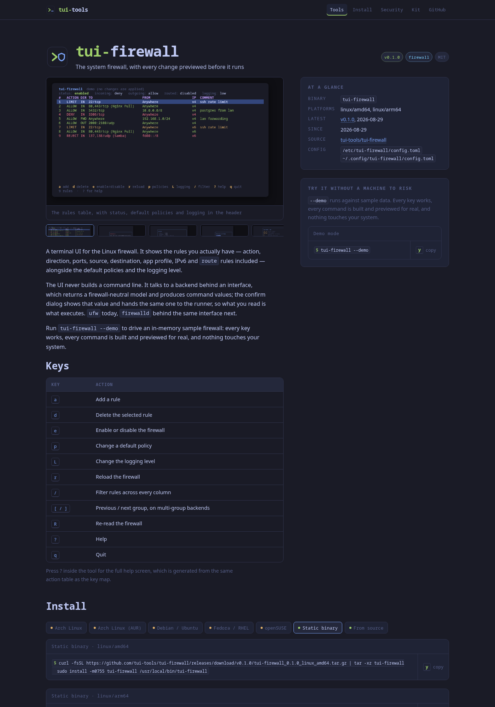
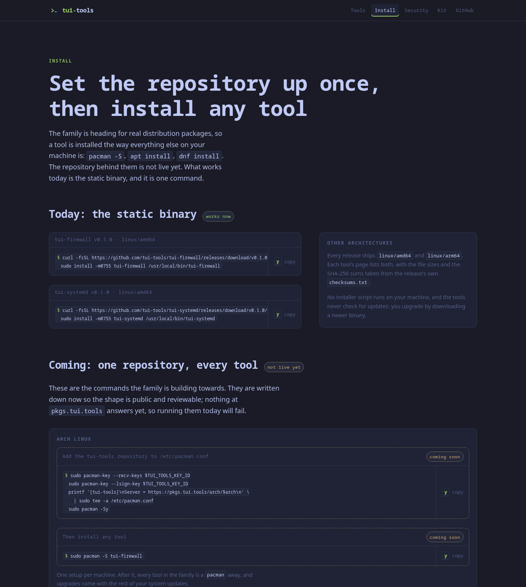

The family website: **[tui-tools.github.io](https://tui-tools.github.io)**.

A marketplace for the [tui-tools](https://github.com/tui-tools) family, built
entirely from each tool's own `tool.json`. Nothing here is edited by hand to add
a tool, change a version, or update a screenshot.





## How it works

```
tui-tools/<tool>/tool.json  ─┐
GitHub releases API         ─┼─► scripts/build-catalog.mjs ─► src/data/catalog.json ─┬─► scripts/build-og.mjs ─► public/og/*.png ─┐
icons and screenshots       ─┘                                                     └───────────────── astro build ─────────────────┴─► Pages
OpenSSF Scorecard API       ───► scripts/build-scorecard.mjs ─► src/data/scorecard.json ──────────────────────────────────────────┘
```

`scripts/build-catalog.mjs` lists the public repositories in the organization
and asks each one for a `tool.json` at the default branch's HEAD. A repository
that has one is a tool; one that does not — `tui-kit`, `.github`, this
repository — is simply not in the grid. For each tool it then collects:

- the **manifest**: tagline, description, category, platforms, keys, install
  channels, security posture, maintainers, and the **backends** the tool drives
  with everything it knows about their versions;
- the **latest release**: tag, date, every asset with its size, and the SHA-256
  sums parsed out of that release's `checksums.txt`;
- the **release history**, for the changelog list on the tool page;
- the **images** the manifest points at — the icon and every screenshot —
  downloaded into `public/tools/<name>/`, so the site serves its own copies and
  loads nothing from an external host at runtime.

A tool with no release yet is kept and marked **unreleased** rather than
hidden. `tui-template` is the standing example.

`scripts/build-scorecard.mjs` runs in the same `npm run catalog` step, right
after the catalog. For every tool in it, plus `tui-kit` and the `tui-tools`
launcher, it asks `api.securityscorecards.dev` for the repository's published
OpenSSF Scorecard result and writes `src/data/scorecard.json`, which the
security page renders. A repository the weekly workflow has not been indexed
for answers 404; that, a timeout and an API that is down are all recorded as
pending and shown as pending. The script never fails the build.

The one thing on the security page that is not built here is the badge image
itself: it is served by the Scorecard API, so it is current even between
builds.

The schema those manifests are validated against lives in the kit:
[`tui-kit/schema/tool.schema.json`](https://github.com/tui-tools/tui-kit/blob/main/schema/tool.schema.json),
documented in
[`tui-kit/docs/tool-manifest.md`](https://github.com/tui-tools/tui-kit/blob/main/docs/tool-manifest.md).

### Link previews

A link to this site is mostly shared into somewhere that draws a card — X,
Slack, LinkedIn, Discord — and that card is the first look most people get.
`scripts/build-og.mjs` draws one per page, 1200×630, into `public/og/<slug>.png`
between the catalog and `astro build`:

- `home`, `install`, `guides`, `security` and `kit` get the **family card**:
  the brand mark, the wordmark, the page's own line, and the domain. Every
  guide points at the `guides` card, so a new guide needs no new artwork.
- every tool gets a **tool card**: `>_ tui-<name>`, the tagline out of its
  `tool.json`, and its first screenshot fitted on the right. The screenshot is
  already on disk — the catalog downloaded it a step earlier — so nothing is
  fetched here, and a tool whose manifest has no screenshot falls back to its
  icon.

`Base.astro` takes an `ogSlug` prop and points `og:image` at the matching file,
absolute, with `twitter:card = summary_large_image`. A page that names no slug
gets the family card, which is what 404 does.

satori renders the layout to SVG and `@resvg/resvg-js` rasterises it; both are
plain npm packages with prebuilt musl binaries, so the `node:22-alpine` build
stage needs nothing installed. The two typefaces come from `@fontsource/*` in
`node_modules`, not from a font CDN, so a build with no network still draws the
same bytes.

### Backend compatibility

A tool that drives someone else's program declares it in the manifest's
`backends[]`, and the site renders that block as the **Compatibility** section
on the tool page: the binary, the minimum version the tool claims, the versions
it has really been tested against, the features that need a given version, and
the version-ranged caveats with what each one does to the user. The grid card
carries the short form of the same fact — `ufw ≥ 0.36` — because that is what
decides whether the tool is worth opening. A tool that shells out to nothing
declares no backends and neither surface shows anything.

`tested` is evidence rather than a claim: the versions come from
`compat/results.jsonl` in the tool's own repository, which its smoke suite
writes while running inside a [tui-lab](https://github.com/tui-tools/tui-lab)
guest, and `tui-kit/tools/compat-sync.py` regenerates the manifest from. The
running binary reads the same block to probe the backend at startup, so a
version the site does not list is one the tool's header marks `(untested)`. The
whole mechanism is documented in
[`tui-kit/docs/compatibility.md`](https://github.com/tui-tools/tui-kit/blob/main/docs/compatibility.md).

`scripts/build-catalog.mjs` copies the block into the catalog minus the fields
only the running binary needs — `versionRegex` and `searchPaths` — since the
probe is the tool's business, not the website's.

## The beta notice

The canonical sentence is:

> Beta: the family is days old and still changing. Package names, flags and
> keys may move without notice until 1.0. Pin versions, and report what breaks.

The tool READMEs carry it word for word, so it is changed everywhere at once or
nowhere. The site says it in four places: the banner under
the masthead on every page (`src/components/BetaBanner.astro`, rendered by
`src/layouts/Base.astro`), the **Before you install** panel on the install page
(`#beta`), the `beta` chip beside every version
(`src/components/VersionChip.astro`, used by the grid card and the tool page),
and the `family` block in `/catalog.json`
(`src/pages/catalog.json.js`). Removing them is a deliberate 1.0 decision, made
once for all four together, not a cleanup: until it is made, they are the only
thing telling a reader that a package name or a key binding can move under
them.

## Adding a tool to the site

There is no step in this repository.

1. Start from [tui-template](https://github.com/tui-tools/tui-template) and
   build the tool.
2. Fill in its `tool.json` — the template's copy is a valid example, and CI
   validates it against the schema on every push.
3. Tag `v0.1.0` and let the release ship.
4. The site picks it up on its **next hourly build**. To not wait, run the
   workflow: `gh workflow run publish.yml -R tui-tools/tui-tools.github.io`.

## Publishing

[`.github/workflows/publish.yml`](.github/workflows/publish.yml) runs on:

| Trigger | Why |
| --- | --- |
| push to `main` | a change to the site itself |
| `schedule`, hourly at :17 | a release in another repository appears within the hour |
| `workflow_dispatch` | rebuild on demand |

It builds the catalog, runs `astro build`, and deploys `dist/` with
`actions/deploy-pages`. Pages is configured with **GitHub Actions** as its
source; there is no `gh-pages` branch.

### Why nothing wakes it

A tool's release could tell this repository to rebuild immediately, and for a
while one did. Doing so needs a token with write access to this repository,
held as a secret on every public tool repository — fourteen copies of a key to
the site, to save at most an hour of staleness on a page nobody is watching
change. **No secrets outside this repository.** The tools publish releases and
the site comes and looks; when an hour is too long, run the workflow by hand:

```sh
gh workflow run publish.yml -R tui-tools/tui-tools.github.io
```

### The custom domain (owner action)

This is the custom domain *on Pages*. To move the domain to a container host
instead, see [Cutover to Quave ONE](#cutover-to-quave-one-owner-action) below,
which supersedes this.

The site is written so switching to `tui.tools` is two settings and no code:

1. Set the repository **variable** `SITE_DOMAIN` to `tui.tools`
   (`gh variable set SITE_DOMAIN --repo tui-tools/tui-tools.github.io --body tui.tools`).
   The workflow then writes `dist/CNAME` and builds the canonical URLs against
   the new host.
2. Add the DNS record: `CNAME tui.tools → tui-tools.github.io`. For an apex
   domain, use the four `A` records GitHub documents for Pages instead, and
   keep a `CNAME` for `www`.

Do **both**. Setting the variable without the DNS record leaves Pages serving a
domain that does not resolve; adding the DNS record without the variable leaves
Pages redirecting to `tui-tools.github.io`. Once DNS is live, turn on *Enforce
HTTPS* in the repository's Pages settings.

Nothing else in the site hardcodes the host: every internal link is
root-relative, which is why this is the organization site repository
(`tui-tools.github.io`, served at `/`) rather than a project repository served
under a path. The three places that need an absolute URL — the canonical link,
`sitemap-index.xml` and `robots.txt` — all derive it from the same `site` value,
so `SITE_URL` is the only knob.

### Sitemap and robots

Both are generated at build time and neither is committed:

- **`sitemap-index.xml` / `sitemap-0.xml`** come from
  [`@astrojs/sitemap`](https://docs.astro.build/en/guides/integrations-guide/sitemap/),
  which walks the pages Astro actually rendered — so a new tool appears in the
  sitemap for the same reason it appears in the grid, with no list to maintain.
  A tool page carries a `lastmod` taken from its latest release date; a page with
  no such date carries none, because an invented `lastmod` is worse than an
  absent one.
- **`robots.txt`** is the endpoint `src/pages/robots.txt.js`, which points at
  the sitemap on whatever host `site` names.

### The machine-readable catalog

`https://tui.tools/catalog.json` is the same family catalog the pages are built
from, cut down to what a program wants: one entry per tool with its package
name, the current version and release date, the backends it drives and the
versions the lab has run them against, and links to the repository, the tool's
page, its release notes and its opening screenshot. Plus the family's three
repository lines and the URL of the key that signs them. It is the endpoint
`src/pages/catalog.json.js`, a projection of `src/data/catalog.json` with every
URL absolute against `site`, so a preview host describes itself and never
production.

It exists for the forthcoming `tui-tools` launcher, and for anything else that
wants the list without scraping HTML. `schema` is the contract: it is bumped
only when a field changes meaning, and new fields are added without bumping it.
The document is rebuilt on the same hourly schedule as the rest of the site,
and served with a ten-minute cache and `Access-Control-Allow-Origin: *`.

**It informs; it is never a source of trust.** A version in it is what the last
build saw on the GitHub API — a claim, not a signature. Installing goes through
the signed repository, where the package manager verifies the repository index
and the package itself, and that verification is the only thing that decides
what reaches a machine. A reader of this document is choosing what to ask
`apt`, `dnf` or `pacman` for; it is not deciding what to trust.

## Hosting

The site runs on GitHub Pages today. It is also packaged as a container, so it
can move to [Quave ONE](https://quave.one) — where the family's analytics
already run — without a rewrite. Nothing below is switched on yet; it is the
path, prepared.

### The image

[`Dockerfile`](Dockerfile) is two stages:

1. **`node:22-alpine`** runs `npm ci`, then the same two commands the workflow
   runs: `npm run catalog` and `astro build`. The container and Pages are
   therefore built from the same source of truth and cannot drift.
2. **`nginx:1.29-alpine`** serves `dist/` and nothing else — no Node, no
   `node_modules`, no token in the shipped image.

Two build arguments:

| Arg | Default | Why |
| --- | --- | --- |
| `SITE_URL` | `https://tui.tools` | The canonical host. Feeds `site`, and through it every canonical link, the sitemap and `robots.txt`. |
| `GITHUB_TOKEN` | empty | Lifts the GitHub API rate limit for the catalog step. |

Two environment variables reach the catalog step as well, both about the
package repository:

| Variable | Default | Why |
| --- | --- | --- |
| `TUI_PKGS_URL` | `https://pkgs.tui.tools` | Where the family's apt, dnf and pacman repository lives. |
| `TUI_PKGS_LIVE` | unset | `true` or `false` skips the probe below and forces the answer, for a build that has to be deterministic. |

The distro channels are declared in every tool's `tool.json` with
`"available": false`, because saying otherwise while nothing answers at
`pkgs.tui.tools` would be a lie a reader discovers at their own shell prompt.
So the catalog step sends one `HEAD` to `TUI_PKGS_URL/install.sh` per build.
If it answers, the channels whose packages that release actually carries are
promoted to available and the install pages turn the commands on. If it does
not answer — not deployed, offline build, a slow day — the pages stay on
*coming soon*, which is what they say anyway. There is no wrong answer to
fall back to, and no file to edit on the day the repository goes up.

`GITHUB_TOKEN` is worth spelling out. Without it the catalog script uses the
anonymous GitHub API, capped at **60 requests per hour per IP** and shared with
every other anonymous caller behind the same address. One catalog run costs
roughly three requests per tool plus one for the org listing, which fits today
and will not once the family grows or the build runs on a shared runner. And the
script's safety net — *keep the catalog already on disk* — has nothing to keep in
a fresh container, so a rate-limited build **fails** rather than shipping a
stale site. Set the token for any build that is not a one-off local one. On
Quave ONE that means an env var marked **Build** or **Both**, which the platform
passes in as the `ARG` the Dockerfile declares.

[`nginx.conf`](nginx.conf) is copied in as a *template*: the entrypoint runs
`envsubst` over it at start-up, so `listen ${PORT}` resolves then. The image
defaults to `PORT=3000`, which is Quave ONE's default app port — keep the two
equal. `NGINX_ENVSUBST_FILTER` limits the substitution to `PORT` so nginx's own
`$uri` survives it. The server block gives `/_astro/` a year (Astro fingerprints
those names), other images a day, HTML and the SEO files `no-cache`, serves a
real `404.html` instead of the SPA-style "index.html with a 200", answers
`/healthz` for the platform probe, and sets the security headers from
[`security-headers.conf`](security-headers.conf).

Build and check it locally:

```sh
docker build \
  --build-arg SITE_URL=https://tui.tools \
  --build-arg GITHUB_TOKEN="$(gh auth token)" \
  -t tui-tools-site .

docker run --rm -p 8099:3000 tui-tools-site
curl -s localhost:8099/ | grep -o '<title>[^<]*</title>'
curl -s localhost:8099/sitemap-index.xml
curl -s localhost:8099/robots.txt
```

### Keeping the container host current

The site's content lives outside this repository: a release in another repo
changes a page here with no commit to push. That is why Pages rebuilds hourly
rather than only on push, and a container host has the same problem without the
same answer — nothing in its git history changed, so nothing tells it to
rebuild.

`publish.yml` has a `ship` job for that. Quave ONE pulls from GitHub only where
its GitHub App is installed, and it is not installed on this organization, so
the job pushes instead: the documented three-step **Code API** — ask for a
pre-signed URL, `PUT` the source tarball, say it landed — and the third step
triggers the build. The image builds the catalog itself, so a build is a fresh
site.

That leaves one wrinkle. The platform reuses the image it already built when the
source is unchanged, which is right in general and wrong here: every hourly run
sends identical source while the *content* has moved on. So the tarball carries
a `.build-stamp` file holding the SHA-256 of the catalog that run built. Nothing
changed upstream, same stamp, same source, image reused and no build minutes
spent; a release shipped, the catalog changes, and the stamp changes the source
and the Dockerfile's `COPY . .` layer with it.

The job is **skipped** unless the repository variable `QUAVE_ENV_NAME` is set:

```sh
gh variable set QUAVE_ENV_NAME  --body tui-tools-tui-site-production
gh secret   set QUAVE_API_TOKEN                  # the app-environment token
```

Set `QUAVE_ENV_NAME` without the secret and the job fails loudly rather than
leaving a site that quietly stops updating. `QUAVE_API_URL` is optional and
defaults to `https://api.quave.cloud/api/public/v1`.

The token is the **app-environment** token, not a user token: it can deploy this
one environment and nothing else. Read it from the environment's page on Quave
ONE, or rotate it there if it ever leaks.

### If the GitHub App is ever installed

Installing the Quave ONE GitHub App on the `tui-tools` organization would let
the platform pull `main` on push and drop the upload half of the `ship` job. It
would **not** replace it: a push is the trigger that this site does not have —
the hourly rebuild is the point — so the job would still have to run, just with
`forceNewBuild` against the build endpoint instead of a tarball. The upload flow
costs one extra minute per run and needs no click, which is why it is what is
wired today.

### Cutover to Quave ONE (owner action)

Steps 1–4 are **done**. They left Pages serving as it always did, which is the
point: everything up to the DNS change is reversible, and the DNS change is the
owner's.

1. ~~**Create the app**~~ — `tui-site` on the `tui-tools` account, CUSTOM preset
   with the root `Dockerfile`, port 3000, health check `/healthz`, SSL on, one
   zCloud, region `us-5` (where the analytics already live). It deploys by
   source upload rather than from GitHub, because that needed no click; see
   above.
2. ~~**Set the build variable**~~ — `SITE_URL=https://tui.tools`, marked
   *Build*. `GITHUB_TOKEN` is **not** set and now has to be; see
   [The build token](#the-build-token-owner-action) below, which is the one
   thing still standing between this and a site that updates itself.
3. ~~**Turn on the rebuild signal**~~ — `QUAVE_ENV_NAME` and `QUAVE_API_TOKEN`
   are set, and the `ship` job runs on every `publish`.
4. ~~**Add the hosts**~~ — `tui.tools` and `www.tui.tools` on the site
   environment, `analytics.tui.tools` on the Umami one.
5. ~~**Point DNS**~~ — done in Cloudflare, and all three names are `VALID` with
   Let's Encrypt certificates issued. The records:

   | Type | Name | Value |
   | --- | --- | --- |
   | `CNAME`, flattened | `tui.tools` | `tui-tools-tui-site-production.zcloud.services` |
   | `CNAME` | `www.tui.tools` | `tui-tools-tui-site-production.zcloud.services` |
   | `CNAME` | `analytics.tui.tools` | `tui-tools-tui-analytics-production.zcloud.services` |

   The apex is the interesting one. `tui.tools` cannot hold a plain `CNAME` —
   no apex can — so it relies on Cloudflare's CNAME flattening, which resolves
   the target and answers with `A` records. An `ALIAS`/`ANAME` record does the
   same thing at registrars that offer it; one that offers neither cannot serve
   an apex from a container host at all, and the answer there is to host at
   `www.tui.tools` and redirect the apex to it.

   The records are DNS-only, not proxied. Proxying them through Cloudflare would
   work but needs an Origin CA certificate on the Quave ONE side; see the
   platform's *Cloudflare as a proxy* guide before turning the orange cloud on.
6. ~~**Set `SITE_DOMAIN`**~~ — already `tui.tools`, so the Pages build renders
   the same canonical host the container does. For the overlap in which both are
   up, they agree.
7. **Keep Pages**, which is a change of plan and worth the paragraph. The
   original step here was to delete the `deploy` job once Quave ONE had proven
   itself. Do not: `tui-tools.github.io` is the URL every existing link and
   bookmark uses, and the redirect from it to `tui.tools` is something GitHub
   does *only while Pages is enabled with the custom domain set*. Turn Pages off
   and those links 404 rather than arriving. So Pages stays, its job now being
   to serve one redirect, and `dist/CNAME` — written by the `write CNAME` step
   from the `SITE_DOMAIN` variable — is what tells it where to send them.

   `www.tui.tools` is the other half of the same idea and is handled in the
   image instead: `nginx.conf` answers that name with a 301 to the apex,
   preserving the path. Two hosts serving identical HTML is a duplicate a
   crawler has to resolve on its own; a redirect resolves it first.

Two loose ends beyond the token:

- The Umami tag in `src/layouts/Base.astro` now points at
  `https://analytics.tui.tools/script.js`, which ships with the next successful
  build. Change the website's domain inside Umami to match, so the numbers keep
  accruing to the same site rather than starting a new one.
- The analytics environment also carries a host `analytic.tui.tools` — singular,
  a typo, with no DNS behind it. It will sit invalid until the platform
  auto-disables it. Remove it from the Hosts tab.

### The build token (owner action)

The container build needs a GitHub token, and this is no longer theoretical. The
first build squeaked under the anonymous limit; the second, minutes later, died
at the sixteenth of seventeen repositories:

```
GET https://api.github.com/repos/tui-tools/tui-samba/releases/latest → 403
API rate limit exceeded for 88.198.69.252.
```

That address is the platform's build node, shared with every other tenant
building on it, and the site's own catalog run costs about fifty requests
against a budget of sixty an hour. An hourly rebuild cannot fit in that, and a
rate-limited build **fails** rather than shipping something stale — the catalog
script's fallback is "keep what is on disk", and a fresh container has nothing.
So until the token exists, the environment keeps serving the last image that
built and stops picking up releases.

Create a **fine-grained personal access token**:

- **Resource owner**: the `tui-tools` organization (or your own account —
  everything it reads is public).
- **Repository access**: *Public repositories (read-only)*.
- **Permissions**: none beyond the default `Metadata: Read`. It reads public
  repository contents and releases, which needs no grant.
- **Expiry**: as long as you are willing to rotate.

Then set it on the environment as `GITHUB_TOKEN`, *Used for: Build*. The next
`publish` run picks it up. Nothing in this repository needs the token: it is a
Quave ONE environment variable, and the Actions build has the runner's own
token with a far higher limit.

## Local development

```sh
npm install
GITHUB_TOKEN=$(gh auth token) npm run dev     # catalog, then the dev server
GITHUB_TOKEN=$(gh auth token) npm run build   # catalog, then a static build
npm run build:only                            # rebuild the pages, reuse the catalog
npm run preview
```

`GITHUB_TOKEN` is optional — without it the catalog script uses the anonymous
API and its 60-requests-per-hour limit, which is enough for one run. If a run
fails while a `catalog.json` is already on disk, the script keeps the old one
and exits successfully, so a rate limit or a dropped connection cannot leave you
without a site to build.

`src/data/catalog.json`, `public/tools/` and `public/og/` are generated and
gitignored. `npm run og` redraws the previews on their own, against the catalog
already on disk.

## What is in here

| Path | What it is |
| --- | --- |
| `scripts/build-catalog.mjs` | The whole data layer: org → manifests → releases → images → `catalog.json` |
| `scripts/build-scorecard.mjs` | The OpenSSF Scorecard result per repository → `scorecard.json`, pending when there is none yet |
| `scripts/build-og.mjs` | The 1200×630 link preview each page points `og:image` at |
| `src/pages/index.astro` | The marketplace grid, with a category filter |
| `src/pages/tools/[name].astro` | A tool: gallery, description, keys, compatibility, install picker, security, downloads, releases |
| `src/pages/install.astro` | Family-level install: the repository setup per package manager, and how to verify a download |
| `src/pages/security.astro` | The family's principles, every tool's answers, what the release gate checks, the Scorecard table and how to report |
| `src/pages/guides/index.astro` | The guides index, published guides only |
| `src/pages/guides/[...slug].astro` | One guide, rendered from the `guides` collection |
| `src/content.config.mjs` | The `guides` collection: its schema, and the editorial rule a guide has to satisfy |
| `src/lib/guides.js` | The one way the site reads the collection, so a draft cannot be listed by one page and served by another |
| `src/components/OutputBlock.astro` | A transcript: the command dialog's frame, without the copy button |
| `src/pages/kit.astro` | What `tui-kit` is |
| `src/pages/robots.txt.js` | `robots.txt`, built from `site` so no host is hardcoded |
| `src/pages/catalog.json.js` | `/catalog.json`, the machine-readable catalog described above |
| `src/components/CommandDialog.astro` | The site's one borrowed idea, below |
| `src/lib/markdown.js` | The safe markdown subset a manifest's `description` may use |
| `src/styles/global.css` | Tokyo Night, and the type rule: the machine speaks in mono, we speak in sans |



## Guides

`/guides/` is a small content collection, not a blog. The rule a guide is
written under is stated in full at the top of
[`src/content.config.mjs`](src/content.config.mjs) and it is the only rule that
matters here: **a guide is born from validated work only.** It is written after
the work, on a machine the commands were actually run on. Every command in it
was run exactly as it appears, every output is a transcript trimmed for length
and never edited for effect, every claim links to evidence a reader can check
without trusting this site, and every failure mode shown was provoked rather
than described. What a check does not prove is stated as plainly as what it
does. A step that could not be run does not go in.

Guides are `.mdx`, which is the only reason MDX is a dependency: the prose
stays markdown while a command a reader is meant to copy is the site's own
`CommandDialog`, the same box every other page shows a command in. A transcript
goes in `OutputBlock`, which is the same frame without a copy button, because
nobody wants to copy an output.

`draft: true` in the frontmatter keeps an entry out of the build entirely. It
is not listed, no page is generated for it, and it gets no sitemap entry, so
there is no URL to find by guessing. The index and the page generator both go
through `publishedGuides()` in [`src/lib/guides.js`](src/lib/guides.js) so the
two can never disagree, and `astro.config.mjs` applies the same skip when it
works out `lastmod`.

## Analytics

The site counts visits with [Umami](https://umami.is), self-hosted on
[Quave ONE](https://quave.one). Nothing is sent to Google, and there is no
third-party network the numbers feed into.

**What is collected.** A page view: the path, the referrer, the screen size, the
browser and OS names, and a country derived from the request. Plus the named
events below, each with a couple of labels. That is the whole list.

**What is not.** No cookies and no `localStorage`: Umami stores nothing in your
browser. No IP address is kept — it is hashed together with a daily-rotating
salt to recognise a repeat visit within one day, and cannot be reversed or
linked across days. No cross-site identifier, no profile, no ad network.

**Events.** These names are stable; treat them as an interface, and add rather
than rename.

| Event | Fired when | Props |
| --- | --- | --- |
| `install-copy` | A command's copy button is pressed | `tool`, `manager` |
| `distro-select` | A package manager tab is chosen on a tool page | `manager` |
| `download` | A release asset link is clicked | `tool`, `asset` |
| `repo-click` | A tool's source repository link is clicked | `tool` |

`tool` is a tool name (or `family` for a command that is not tool-specific),
`manager` is the install path (`pacman`, `aur`, `apt`, `dnf`, `zypper`,
`binary`, `source`, …).

**How to opt out.** Turn on "Do Not Track" in your browser and the script stands
down: the tag carries `data-do-not-track="true"`, so it sends nothing at all.
Any content blocker also stops it, and the site works exactly the same without
it — nothing on the page waits for the script, and nothing breaks when it never
arrives.

## The design, in one paragraph

Every tool in the family shows a command inside a box and asks `y` or `n` before
running it. Installing a tool is previewed the same way here: every command on
the site sits in that same dialog, and the copy button **is** the `y` key. The
palette is Tokyo Night, carrying the meaning the branding gives it — green marks
what the family shares, blue marks what one tool adds, so family pages accent
green and a tool's page accents blue. Anything the machine says is set in
monospace; anything we say is set in sans. Fonts are a system stack and every
image is served from this repository; the one request that leaves the page is
the analytics script described above.

## Unofficial

These tools follow the [Omarchy](https://omarchy.org) visual style and read its
theme files. They are **not** part of the Omarchy project and are not endorsed
by its maintainers.

MIT — see [LICENSE](LICENSE).
